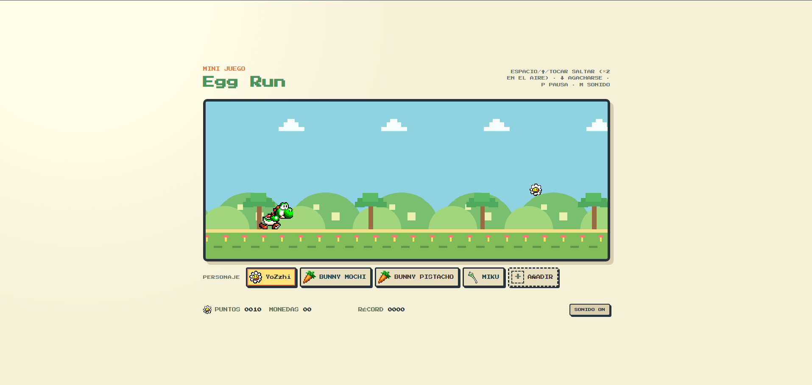
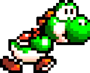
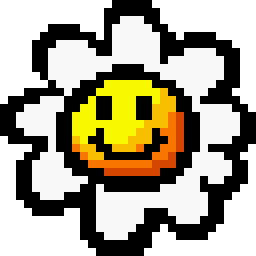
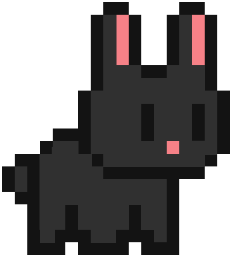
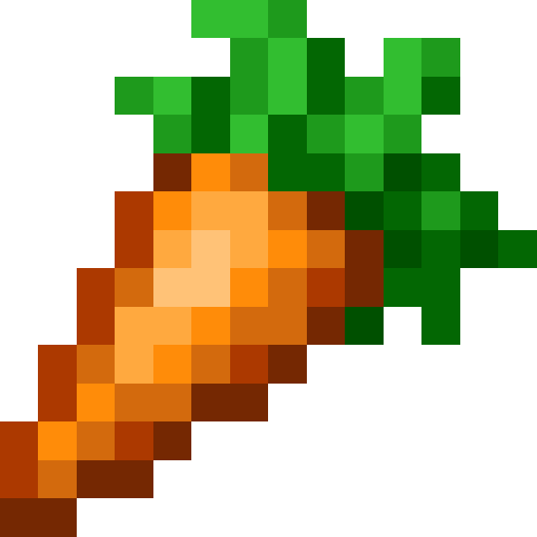
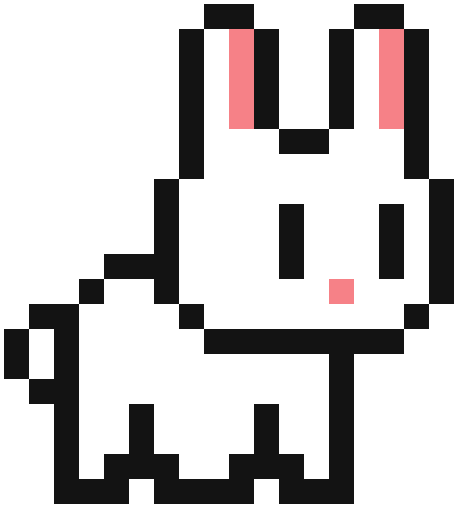
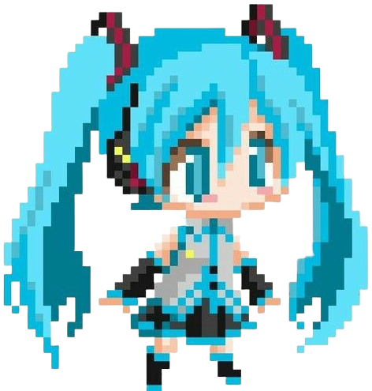
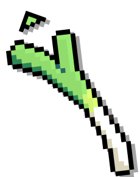
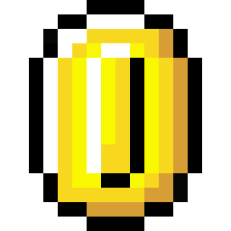
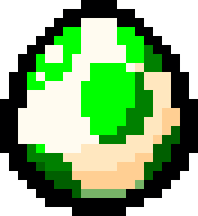

# 🥚 Egg Run

Mini juego **runner infinito (endless runner)** en pixel art, hecho con **React + Vite** y dibujado sobre **Canvas**. Controla a **YoZzhi** mientras corre por un mundo cuyo paisaje cambia de día a atardecer y de noche: esquiva huevos y pájaros, agachate, salta en doble salto, recoge monedas y supera tu récord.



## 🎮 Cómo se juega

- **ESPACIO / ↑ / Tocar la pantalla** → saltar (puedes saltar **2 veces en el aire**)
- **↓ / S** → agacharse (mantener pulsado)
- **P / ESC** → pausa
- **M** → silenciar sonido
- El **botón JUGAR** o **ESPACIO** también inicia y reinicia la partida

A medida que avanzas la velocidad aumenta y el puntaje crece. Choca contra un huevo o pájaro y la partida termina… a menos que tengas un escudo.

## 🪙 Monedas y combos

- Recoge monedas que aparecen a distintas alturas para sumar puntos.
- Cada moneda seguida sin fallar construye una **CADENA (combo)**.
- La cadena suma puntos extra: una racha de 3+ monedas aumenta el valor de cada moneda hasta **+40 puntos**.
- Pierdes la cadena si te golpeas (o tras unos segundos sin recoger).

## ⚡ Power-ups

Aparecen flotando sobre el suelo y duran unos segundos:

| Ícono | Power-up | Efecto |
| --- | --- | --- |
| 🛡️ | **ESCUDO** | Te protege de un golpe (con destello de invulnerabilidad temporal) |
| 🧲 | **IMÁN** | Atrae las monedas hacia ti |
| ✖️2 | **×2** | Duplica todos los puntos que consigues |

## 🌅 El paisaje (fondos)

El fondo no usa imágenes: se **dibuja en tiempo real sobre el canvas** con tres paletas que se mezclan según avanzas. Cada **1500 puntos** el ciclo comienza de nuevo: **día → atardecer → noche → día**.

| Fase | Cielo | Tierra | Árboles | Flores |
| --- | --- | --- | --- | --- |
| 🌞 **Día** | `#8dd3e4` | `#7fbd58` | `#4eaa5c` | `#ef7a74` |
| 🌇 **Atardecer** | `#f6a86b` | `#b0865a` | `#8f6b4a` | `#ffb34d` |
| 🌙 **Noche** | `#1d2b53` | `#3a2a4a` | `#27415f` | `#ff9dd0` |

Incluye nubes a la deriva, colinas, árboles, estrellas titilantes (de noche) y flores con marcas de velocidad en el suelo.

## 👾 Personajes

Elige tu corredor con el selector **PERSONAJE** antes de empezar. Cada uno tiene su propio sprite y su icono de moneda.

| Personaje | Sprite | Moneda |
| --- | :---: | :---: |
| **YoZzhi** |  |  |
| **BUNNY MOCHI** |  |  |
| **BUNNY PISTACHO** |  |  |
| **MIKU** |  |  |

> **BUNNY MOCHI** y **BUNNY PISTACHO** comparten el mismo icono de moneda (`bunny-point.webp`), mientras que **YoZzhi** y **MIKU** tienen cada uno el suyo.

### ➕ Personajes personalizados

- Pulsa **AÑADIR** y sube cualquier imagen **PNG (máx. 1 MB)** para usarla como personaje.
- Ponle nombre y queda guardada en tu navegador (`localStorage`).
- Los personajes personalizados usan como moneda el icono por defecto:  (`default-coin.png`).
- Puedes tener hasta **8 personajes personalizados** y borrarlos o deshacer la última adición en cualquier momento.

## 🐣 Obstáculos

| Obstáculo | Sprite |
| --- | :---: |
| **Huevo** 🥚 (en el suelo, tamaño aleatorio) |  |
| **Pájaro** 🐦 (volador, dibujado con Canvas) | — |

## 🎵 Sonido

Toda la música y los efectos se generan con la **Web Audio API** (sin archivos de audio): melodia arcade con bajo, efectos de salto, doble salto, moneda, combo, power-up, récord y sonido de agacharse. Usa **M** o el botón **SONIDO ON/OFF**.

## ⭐ Otros detalles

- **Récord guardado**: tu mejor puntuación se conserva en el navegador.
- **HUD en vivo**: puntos, monedas, cadena activa y récord.
- **Pausa automática** al perder el foco o cambiar de pestaña.
- **Pantalla final** con puntos, monedas, distancia, mejor cadena y aviso de **¡NUEVO RÉCORD!**.

## 🚀 Tecnologías

- [React 19](https://react.dev/) + [Vite](https://vitejs.dev/)
- Canvas 2D para el renderizado (60 FPS)
- Web Audio API para música y FX
- `localStorage` para récords, piel favorita y personajes personalizados
- [Oxlint](https://oxc.rs/) para linting

## 📦 Cómo ejecutarlo

```bash
npm install     # instalar dependencias
npm run dev     # modo desarrollo (http://localhost:5173)
npm run build   # compilar para producción
npm run lint    # revisar el código con Oxlint
npm run preview # previsualizar el build
```
